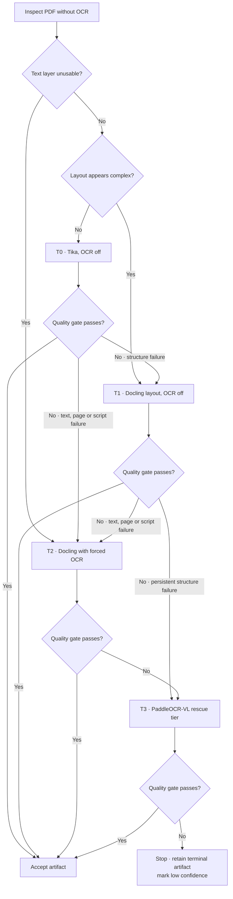

# Extraction routing flow

This diagram explains the ICADL 2026 benchmark's cheap-first extraction policy
and deterministic quality-gate escalation. It reflects the current
implementation in `src/routing.ts` and `src/quality-gate.ts`.

## Current policy state

The frozen initial-routing thresholds select T2 when text-layer coverage is
below `0.75`, full-page-image ratio is at least `0.25`, or encoding-anomaly
ratio is at least `0.01`. Otherwise, mean image-area ratio of at least `0.20`
or characters-per-page variation of at least `0.75` selects T1; the remaining
documents select T0. T3 is never an initial route.

The quality gate measures character sanity, text retention, usable-page ratio,
structural yield and script consistency. The component thresholds were frozen
on 2026-08-06 at 0.99, 0.75, 0.75, 1.00 and 0.95 respectively (gate policy
hash `3f8d9674a8ecbb39a17bb1aeab4fe77e814fef0de8c693965064a0d54685cd8d`; see
`results/phase5-paper-20260806/`). The current implementation also needs
declared-language evidence for raster-only text scans so loss of expected Thai
does not become an unavailable script-consistency component.

The router allows at most two escalations, never repeats a tier and records the
full trace. If the terminal tier fails, it retains the terminal artifact and
labels the result low confidence; it does not re-compare against or fall back
to an earlier artifact. (Corrected 2026-08-06: an earlier revision of this
document wrongly described a best-earlier-artifact fallback.)
